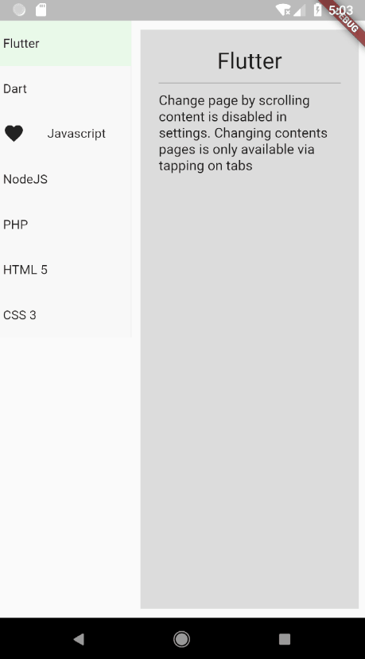
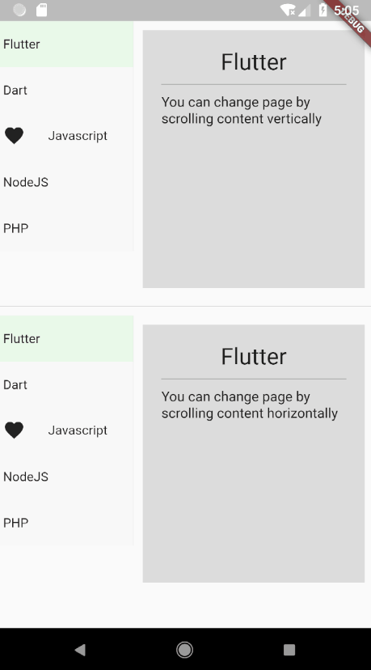
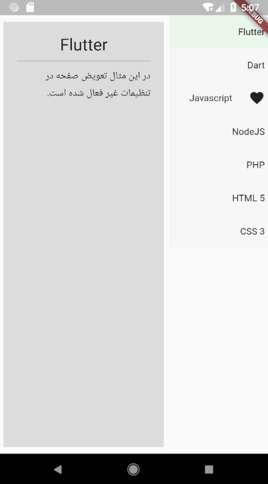

# Vertical Tabs

A vertical tabs package for flutter framework.

## Getting Started

A simple example of usage. to get more examples see `Examples` directory.  
To see all settings please visit API reference of this package

```dart
...

VerticalTabs(
  tabsWidth: 150,
  tabs: <Tab>[
    Tab(child: Text('Flutter'), icon: Icon(Icons.phone)),
    Tab(child: Text('Dart')),
    Tab(child: Text('NodeJS')),
    Tab(child: Text('PHP')),
    Tab(child: Text('HTML 5')),
  ],
  contents: <Widget>[
    Container(child: Text('Flutter'), padding: EdgeInsets.all(20)),
    Container(child: Text('Dart'), padding: EdgeInsets.all(20)),
    Container(child: Text('NodeJS'), padding: EdgeInsets.all(20)),
    Container(child: Text('PHP'), padding: EdgeInsets.all(20)),
    Container(child: Text('HTML 5'), padding: EdgeInsets.all(20))
  ],
),
  
  
```

<hr>





<br><hr><br>


Scroll direction of content



<br><hr><br>

RTL

